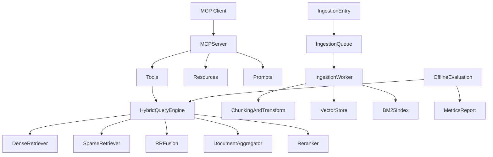

# llm_wiki 增强 MODULAR-RAG-MCP-SERVER 设计文档（评审版）

## 1. 文档目标与范围

### 1.1 目标

- 评估并规划如何将 `llm_wiki` 的成熟能力迁移到 `MODULAR-RAG-MCP-SERVER`。
- 在不破坏现有 MCP 使用方式的前提下，提升检索质量、MCP 可发现性与摄取可靠性。
- 给出可落地的分阶段实施路径，支持“先评估再执行”。

### 1.2 范围

- 仅包含设计、方案、接口与验收定义。
- 仅覆盖 `MODULAR-RAG-MCP-SERVER` 内部能力增强，不涉及上层产品 UI 变更。
- 默认保持现有 Python 技术栈，不引入 Tauri/Rust 运行时依赖。

### 1.3 非目标

- 不进行 `llm_wiki` 的代码级整仓迁移。
- 不在本阶段引入高风险基础设施替换（如全量向量库迁移）。

---

## 2. 背景与现状

### 2.1 当前能力概况

- MCP 层：已提供 `query_knowledge_hub`、`list_collections`、`get_document_summary`。
- Query 层：具备 Dense + Sparse + RRF + 可选 rerank 的主链路。
- Ingestion 层：具备加载、分块、增强、向量化、落库流程。

### 2.2 已识别问题

- 默认 `collection` 语义不一致，跨工具行为可能不一致。
- MCP 仅有 tools，缺乏 resources/prompts 可发现接口。
- 检索结果以 chunk 粒度为主，文档级聚合能力不足。
- 摄取缺少统一任务队列与重试恢复机制。

### 2.3 约束条件

- 需兼容现有 MCP 客户端调用行为。
- 必须保留配置驱动模式。
- 变更应支持灰度与回滚。

---

## 3. 对标能力拆解（llm_wiki）

### 3.1 检索能力

- 混合检索融合策略成熟（关键词 + 向量 + RRF）。
- 具备从 chunk 命中到文档级结果组织的思路，可降低碎片噪声。

### 3.2 摄取能力

- 两阶段摄取编排与可恢复队列机制。
- 包含任务重试、状态持久化、失败处理路径。

### 3.3 质量与评测

- 有场景化测试与回归思路，支持对改造收益做量化验证。

### 3.4 迁移原则

- 迁移“能力模型/算法流程”，不是迁移运行时实现。
- 采用 Python 同构实现，避免栈耦合。

---

## 4. 差距分析（Gap Analysis）

| 能力项 | 当前状态 | 目标状态 | 优先级 | 实施成本 | 风险 |
|---|---|---|---|---|---|
| 默认 collection 一致性 | 多处默认值不统一 | 配置单一真源 | P0 | 低 | 低 |
| RRF 融合策略细化 | 基础 RRF | 权重可调、可评估 | P0 | 中 | 低 |
| chunk->document 聚合 | 弱 | 文档级排序稳定输出 | P1 | 中 | 中 |
| MCP resources/prompts | 无 | tools/resources/prompts 全套可发现 | P0 | 中 | 中 |
| 摄取任务队列 | 弱 | 队列化 + 重试 + 恢复 | P1 | 中高 | 中 |
| 向量后端声明一致性 | 配置与实现可能偏差 | 声明即实现或文档收敛 | P2 | 中 | 低 |

---

## 5. 目标架构（增强后）

### 5.1 Query 数据流

1. 客户端通过 MCP tools 发起查询。
2. Dense/Sparse 并行召回。
3. 通过 RRF 融合排序。
4. 进行 document 级聚合与可选 rerank。
5. 输出结构化响应（文本+引用+元数据）。

### 5.2 Ingestion 数据流

1. 摄取请求进入任务队列。
2. Worker 执行加载、分块、增强、编码、落库。
3. 失败任务按策略重试，状态写入持久层。
4. 支持中断后恢复与可观测追踪。

---

## 6. 分阶段实施方案

## 6.1 阶段A：一致性修复（P0）

### 目标

- 统一 `collection` 默认值来源，消除工具间语义不一致。
- 确保配置声明与实现支持矩阵一致。

### 实施项

- 设定 `vector_store.collection_name` 为默认集合唯一来源。
- MCP tools 未传 `collection` 时统一回落到该配置值。
- 配置注释、README、工厂注册能力保持一致。

### 交付物

- 一致性规则清单。
- 回归测试：跨 tools 默认行为一致。

---

## 6.2 阶段B：检索质量提升（P0/P1）

### 目标

- 提升 dense/sparse 融合质量。
- 降低 chunk 结果碎片化，增强文档级可读性。

### 实施项

- 在现有 RRF 基础上支持权重配置（含默认策略）。
- 增加 document 聚合策略：
  - 同文档 chunk 合并
  - Top chunk 主导 + tail chunk 衰减加权
  - 保留可解释元信息（聚合来源 chunk）
- 输出中显式标记聚合信息，便于调试。

### 验收指标

- Top-K 命中率、MRR、NDCG 相比基线提升。
- 人工抽样相关性评分提升。

---

## 6.3 阶段C：MCP 能力扩展（P0）

### 目标

- 在不破坏现有 tools 的前提下，补齐 resources/prompts。

### 实施项

- 增加 resources：
  - `mrag://config/settings`
  - `mrag://prompts/{name}`
  - `mrag://collections/overview`
- 增加 prompts：
  - `retrieval_answer`
  - `document_summary`
  - `rerank_instruction`
- 与 `config/prompts/*.txt` 建立映射关系。

### 兼容策略

- 旧客户端仅使用 tools 时不受影响。
- 新客户端可通过 list/read/get 能力动态发现。

---

## 6.4 阶段D：摄取可靠性升级（P1）

### 目标

- 建立可恢复、可重试、可观察的摄取执行体系。

### 实施项

- 设计 `IngestionQueue` 与状态机：
  - `pending` / `running` / `retrying` / `succeeded` / `failed` / `cancelled`
- 失败重试策略：
  - 指数退避
  - 最大重试次数
  - 可分类错误（可重试/不可重试）
- 状态持久化：
  - 任务元数据与执行日志落盘
  - 进程重启后恢复未完成任务

### 可观测性

- 指标：队列长度、成功率、重试率、平均耗时、失败分布。

---

## 7. 接口设计草案

### 7.1 MCP Tools（兼容+增强）

- `query_knowledge_hub(query, top_k?, collection?)`
- `list_collections(include_stats?)`
- `get_document_summary(doc_id, collection?)`
- （可选）`enqueue_ingestion(file_path, collection?, priority?)`
- （可选）`get_ingestion_task(task_id)`

### 7.2 MCP Resources（新增）

- `mrag://config/settings`：运行配置快照（脱敏）
- `mrag://prompts/{name}`：提示词内容
- `mrag://collections/overview`：集合统计摘要

### 7.3 MCP Prompts（新增）

- `retrieval_answer`
- `document_summary`
- `rerank_instruction`

---

## 8. 配置设计与兼容策略

### 8.1 关键配置项

- `vector_store.collection_name`：默认集合唯一来源。
- `retrieval.rrf_k`：RRF 平滑参数。
- `retrieval.rrf_weights`（新增候选）：Dense/Sparse 权重。
- `retrieval.doc_aggregation`（新增候选）：文档聚合参数。
- `ingestion.queue`（新增候选）：重试、并发、恢复策略。

### 8.2 兼容与迁移

- 对历史配置保留兼容读取逻辑。
- 对弃用字段输出 warning，不立即破坏。
- 提供“旧行为→新行为”映射表。

---

## 9. 测试与验证计划

### 9.1 单元测试

- RRF 加权逻辑。
- 文档聚合算法。
- queue 状态机与重试策略。
- MCP resources/prompts 处理逻辑。

### 9.2 集成测试

- tools/resources/prompts 端到端协议行为。
- 摄取后检索一致性验证。
- 重启恢复与任务继续执行。

### 9.3 评估基线

- 建立固定查询集与标注集。
- 每阶段输出对比报告（改造前/后）。

---

## 10. 风险与缓解

### 10.1 协议兼容风险

- 风险：部分客户端对 resources/prompts 支持不完整。
- 缓解：保持 tools 优先可用，新增能力可选使用。

### 10.2 性能风险

- 风险：文档聚合与重排带来额外计算开销。
- 缓解：提供开关与阈值，支持按查询规模动态启用。

### 10.3 运维风险

- 风险：队列堆积导致延迟增长。
- 缓解：并发控制、优先级调度、失败熔断。

---

## 11. 里程碑与完成定义（DoD）

### M1（阶段A）

- 默认集合行为一致。
- 配置和实现支持矩阵一致。

### M2（阶段B）

- RRF 与 doc 聚合上线可控。
- 离线评测指标优于基线。

### M3（阶段C）

- MCP 完整支持 tools/resources/prompts。
- 客户端可发现并调用。

### M4（阶段D）

- 队列机制稳定，支持重试与恢复。
- 可观测指标可用于运营排障。

---

## 12. 决策记录（ADR）模板

### ADR-001：迁移策略

- 决策：能力抽取 + 渐进替换。
- 理由：降低跨栈耦合和一次性改造风险。

### ADR-002：优先级策略

- 决策：P0 先行（语义一致 + 检索收益 + MCP可发现）。
- 理由：投入较小但收益直接。

### ADR-003：MCP 扩展策略

- 决策：在兼容 tools 前提下扩展 resources/prompts。
- 理由：提高可发现性与复用能力。

---

## 13. 附录

### 13.1 指标定义

- Top-K Hit Rate
- MRR
- NDCG
- 人工相关性评分（Likert 量表）

### 13.2 术语表

- Chunk：分块文本单元
- Document Aggregation：文档级聚合排序
- RRF：Reciprocal Rank Fusion
- MCP：Model Context Protocol

### 13.3 评审清单（用于决策）

- 是否接受 P0 全量执行？
- P1 中是否优先“doc 聚合”还是“ingest queue”？
- 是否在本轮纳入 P2 的向量后端扩展？

